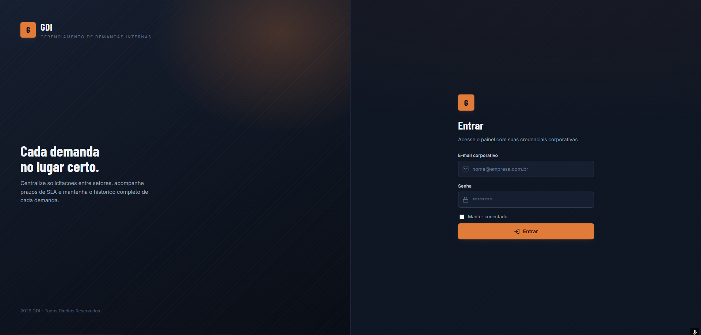

# GDI - Internal Demand Management System

## Screenshots

### Login



### Dashboard


GDI is a Java web application for managing internal demands across teams and departments. It centralizes requests, tracks ownership and status, keeps the conversation history attached to each demand, and provides operational dashboard exports.

## Stack

- Java 11
- Jakarta-style Servlets and JSP on the Java EE Servlet API
- Maven
- MySQL
- MySQL Connector/J
- JasperReports for dashboard PDF export

## Features

- Demand CRUD
- User, department, category, and status CRUD
- Comments on demands
- File attachments and downloads
- Notifications for recent activity and overdue SLA items
- Demand status history/activity timeline
- Search and filtering across demands
- Dashboard export to Excel-compatible HTML
- Dashboard PDF export with JasperReports
- Authentication filters for protected views
- Persistent login with an HttpOnly remember-me token

## Architecture

The project keeps a traditional layered structure under `gdi/src/main`:

- `java/dao`: database access objects and SQL operations.
- `java/servlet`: request handling, form actions, exports, uploads, and redirects.
- `java/models`: domain objects used by DAOs, servlets, and JSP views.
- `java/filters`: authentication, authorization, session preparation, and persistent login.
- `java/bd`: database connection factory.
- `java/util`: shared validation support.
- `webapp/views`: JSP views and reusable templates.
- `webapp/css` and `webapp/scripts`: frontend assets.

## Database

The database script is available at:

```text
database/banco_b2_java3.sql
```

Import it into MySQL to create and seed the `gdi_db` database:

```bash
mysql -u root -p < database/banco_b2_java3.sql
```

## Configuration

`bd.ConexaoBanco` reads the connection settings from JVM system properties:

- `DB_URL`
- `DB_USER`
- `DB_PASS`

If those properties are not provided, the application falls back to development defaults:

```text
DB_URL=jdbc:mysql://localhost:3306/gdi_db?useSSL=false&allowPublicKeyRetrieval=true&serverTimezone=America/Sao_Paulo&autoReconnect=true&useUnicode=true&characterEncoding=UTF-8
DB_USER=root
DB_PASS=root
```

These default credentials are only for local development. In production, always pass real credentials through system properties or the application server configuration.

Example JVM options:

```bash
-DDB_URL="jdbc:mysql://localhost:3306/gdi_db?useSSL=false&allowPublicKeyRetrieval=true&serverTimezone=America/Sao_Paulo&useUnicode=true&characterEncoding=UTF-8" -DDB_USER="gdi_user" -DDB_PASS="change-me"
```

## Build

From the Maven project directory:

```bash
cd gdi
mvn clean package
```

The WAR file is generated under `gdi/target/`.

## Run On Tomcat

1. Install and start MySQL.
2. Import `database/banco_b2_java3.sql`.
3. Configure `DB_URL`, `DB_USER`, and `DB_PASS` as JVM system properties, or use the local development defaults.
4. Build the project with Maven.
5. Deploy `gdi/target/gdi-1.0.0.war` to Tomcat.
6. Open the application in the browser using the deployed context path.
